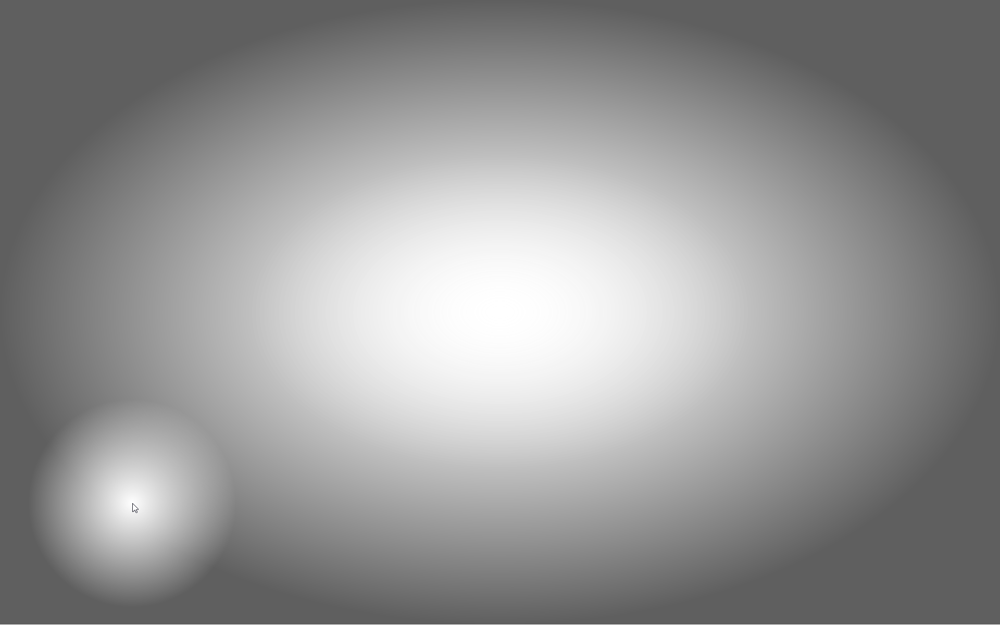

A few weeks ago I saw some people chatting about the benefits of 20-20-20 timers.
The idea is that to reduce eye strain (as we tend to stare at screens all day...)
you set a timer so that every 20 minutes you spend 20 seconds looking at something that's 20 feet away.

So I looked for an existing timer, and there are quite a lot of them, but they all have their issues.
The main one, that is shared between _all_ timers I could find, is that they use notifications to tell you the time's up.
And the problem with notifications is that I always ignore them.
Well, not always, but if I'm focused enough to _need_ a timer to look away from the screen, I will definitely ignore a notification.
So not finding an existing solution, I went and created[^1] my own, with my own specifications.

The main thing, of course, was figuring out the notification problem.
I wanted something that I can't ignore easily, so that I actually stop and look away when I need to;
while not _too_ annoying, so that I don't turn it off and forget about it.
What I ended going for is a gradient overlay for the screen, making it dark on the edges and almost-normal in the middle.
To ensure I can still click whatever I might need to, it's transparent around the mouse pointer as well.

When the 20 minute timer expires, the overlay darkens gradually, letting me know I need to pause.
Sure, I can keep working, but it is a little annoying and a constant reminder to stop.
I've been using it for over a week now, and it seems to work well for me.

To turn hide the overlay, I need to lock the screen for 20 seconds or longer.
I get a small "beep" sound letting me know when I've done it.

Another issue is that there are _some_ cases where I don't actually want to look away.
I want to make sure none of these cases makes me turn the app off, as I will _never_ remember to turn it back on.
So the first two options I added (and stuck with) are:
1. "Pause until unlock" - keeps the overlay from showing until I unlock the screen again.
    This is sometimes a _very_ long time, especially at home, but still ensures the timer
    will start again at _some_ point.
2. "Pause for..." - guarantees I have until %d minutes before it shows the overlay, effectively extending my timer.

These have worked well for me (especially as I _can_ use them even after the overlay is shown),
and I managed to completely avoid exiting the app.

I'm also working on some automatic "I'm busy!" detection to avoid annoying overlays.
These are promising, but need more work:
1. "In a meeting" - detect camera/microphone usage as an indicator for video-meetings.
    I generally don't want to lock my screen during a meeting, but would like to get
    the overlay shown as soon as it is over.
2. "Watching a movie" - no-one wants to have the screen go darker right at the climax of a movie.
    To avoid this, I'm experimenting with hueristics for "a movie is playing". 
    This proves a little tricky.

While using the app, I ran into another small issue relating to locking the screen - 
if I have media playing, I want to pause it (at least in most cases).
So I added it as a feature - whenever I lock the screen now, the currently playing media will pause.
It doesn't work for VLC (I am using the Windows SMTC API and VLC does not),
but it works for YouTube, so I'm happy.

The app is available at https://github.com/tmr232/easy-eyes and you're free to use it,
but keep in mind that it is a personal project aimed to make _me_ happy.

[^1]: Yes, I vibe-coded it. I feel that for small projects like this, where most of the work would be looking up
    Windows APIs and copying examples from SO until something works, vibe-coding is a reasonable solution.
    It also makes it time-effective enough to do a project I couldn't justify otherwise.
    The icon is hand-crafted based on public-domain art.