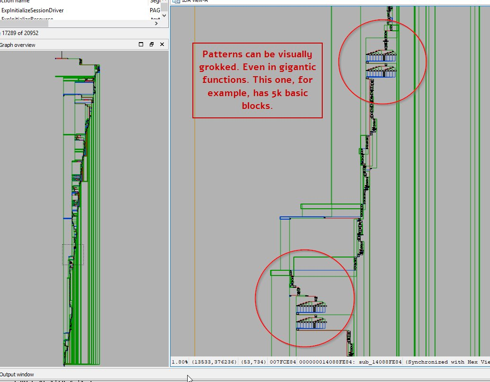
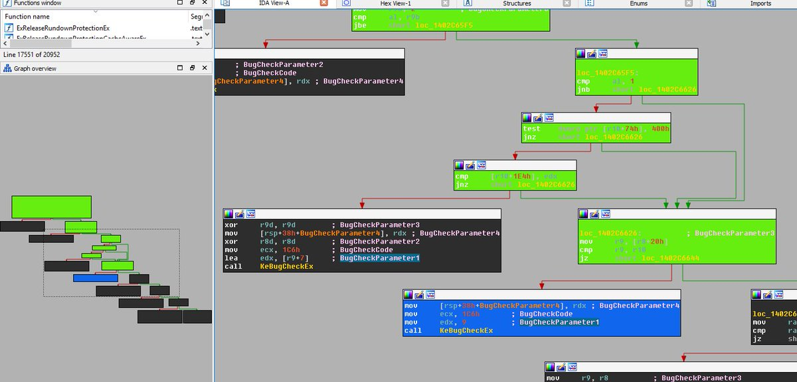

_This is another post converted from a twitter thread._
_The original was published in 2018._

Reading a lot of C++ code lately, there are quite a few features I miss from tools for binary reverse engineering.

## Instant renaming

Want to give a function a name that is more indicative for you? Go ahead. Just hit 'rename', rename, and you're done. No waiting, no missed spots. Everything renamed instantly. Even in projects with >300k functions. 

## Instant xrefs (uses) for identifiers

Both globally and inside functions. Just click, and you have it. No waiting. Sure, it can miss in some cases if your analysis isn't good enough, but that's just because it's binary analysis.

## Repeatable function comments

Tired of going into a function, or hovering it, to get the documentation?  
Repeatable functions show on every call site. Write the relevant notes there and see them everywhere. Jumping into functions is mentally expensive.

## Graph-view / function flow graphs

You can instantly get an estimate of the complexity & flow of a function. You can visually see loops and branches. This allows you to quickly scan through functions, then zoom in on the interesting parts.

Even in text, the gutter contains arrows indicating jumps in the code

## Colors

I can easily use color to add meaning to the flow-graph. I can mark lines or basic blocks in whatever color I want to instantly see meaning.  
In the picture, all the nodes that can reach the blue node are painted green.

## Named bookmarks

Not much to show here, but being able to have a list of interesting locations + the reason they are interesting is super handy.

## Comments are linkable

I can "go to definition" by double-clicking on a function name *in a comment*. This is super useful when reading a long explanation and jumping around a bit to make sure you get it.

## Add Missing Info

Since this is a research tool, I can also teach it things it didn't know. Like function signatures or indirect-call it failed to deduce on its own

## Rename and comment without modification!

A major difference from code-reading tools is that here, the code is completely static. It is what it is. You don't change it, you don't compile it. Comments & renames don't change the code - they are only added in my view.

So unless you're fixing analysis issues, you don't need to re-analyze as much as with code-editors.  
This also allows for more expressive function names

## Summary

Instant navigation + the visual impact of the graphs make for a super-fast workflow. You can easily traverse large amounts of code while hardly reading it.  
Jump, see a familiar pattern, rename function for future reference, jump to next location.

This kind of visual information, seeing the "shape" of a function, is missing from code-editors. You can't zoom out to get a better perspective.  
[Peter Hilton](https://hilton.org.uk/) did a great job discussing the visual shortcomings of code editors in his talk [Beautiful code: typography and visual programming](https://www.youtube.com/watch?v=7vPh-xy-kyc).

## Scripting support as a priority

Additionally, scripting is a first-class citizen in the UI. The default workspace contains a Python CLI that can be used to query and analyze the codebase, or to automate boring tasks. CLI vs. plugins means that you can code-as-you-go, and don't need a polished plugin with a GUI