Over the last few weeks I've been working on a VSCode extension for visualizing the control-flow-graph (CFG) for the function you're reading.

If you want, you can [play with the live demo](https://tmr232.github.io/function-graph-overview/), [install the extnsion](https://marketplace.visualstudio.com/items?itemName=tamir-bahar.function-graph-overview), or [look at the code](https://github.com/tmr232/function-graph-overview/).

While some choices for the visualization are rather straightforward, some are not.
So I want to go over the choices I made and the reasoning for them.

## Basic Control Flow

First - to represent a block of code, we use a block.
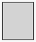

The more code we have in the block, the taller the block will become.

This helps give a basic sense of "how much code is there?"

Next, to connect two blocks we use arrows.
The default color is blue.
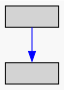

Since the graph can get quite large, we mark the entry-point in green and all the exits (`return` statements, mostly) in red.
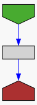

Then we have conditions (`if`).
We use green for the consequence branch (when the condition holds) and red for the alternative (when the condition evaluates to `false`).
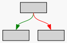

For `switch` statements, we have two possible representations: chained-ifs, or flat.
Since both have their benefits, choosing between them is a configurable option.

| Chained                                              | Flat                                                 |
| ---------------------------------------------------- | ---------------------------------------------------- |
| 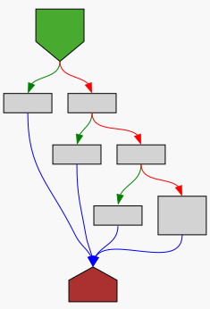 | 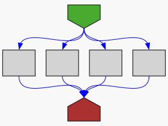 |

For loops we use the same structures we used before.
Green for the consequence, leading us into the loop body; red for the alternative case, leaving the loop.
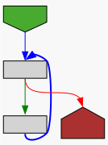

You might notice that the arrow pointing back to the top of the loop has a thicker line.
We make all back-linking arrows thicker so that they are easily distinguished from other arrows, as they are structurally distinct.

These are the basic blocks of our graph, showing the flow of the program.
But there are some structures that break the flow of the code.

## Exceptions & Context Managers

While most control-flow structures translate well to graphs, exceptions are an exception.
Since every line of code can potentially raise an exception, drawing all the arrows would make the graph entirely unreadable.
Instead, we use clusters.
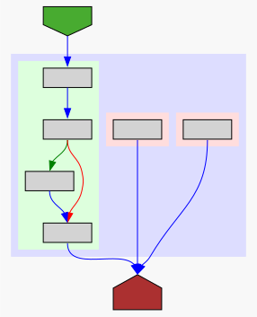

We surround the entire `try-except-else-finally` construct with a pale-blue background to let us know everything within it is part of the same thing.
For the `try` block we use a green background, letting us know that this is the "happy path".
`except` blocks are separately surrounded by pale-red backgrounds, letting us know that they can be reached separately.

The `else` block, if present, is placed in the surrounding blue background.
This separates it clearly from the `try` block, letting us know that exceptions from it are _not_ handled in this blue cluster.
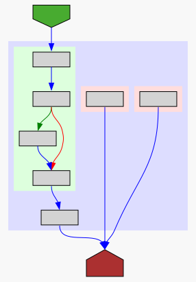

Then, with `finally`, things get a little tricky.
In a simple case, we just give it a yellow background and call it a day.
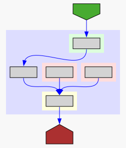

But it's interaction with `return` statements in the preceding blocks can result in interesting flows.

Below, we have the flow for a `try-except` block, where the `except` clause returns from the function.
Next to it, we have the same structure if a `finally` clause is added:

| `try-except(return)`                                 | `try-except(return)-finally`                         |
| ---------------------------------------------------- | ---------------------------------------------------- |
| 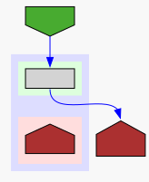 | 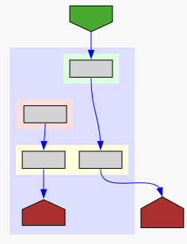 |

In this case, there are 2 separate flows out of the `try-...` block.
To keep them separate, we duplicate the `finally` block for every flow.
While this is useful, it can get a bit crazy when the `finally` block has logic inside it:
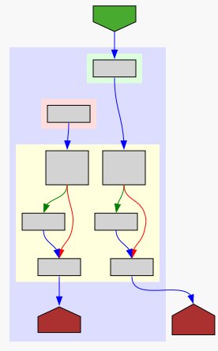

### Context Managers

The `with` statement gets a similar treatment, this time with a light-fuschia background:
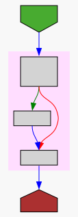

When nested, we also add a white border to separate the levels.
The same border technique is used for exceptions as well.
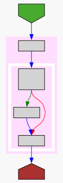

## Special Nodes

In addition to the function entry-point and `return` statements, `raise` and `yield` also get special treatment:

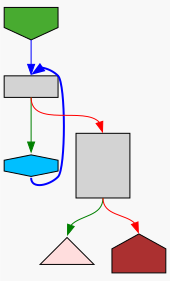
`raise` statements get a triangle in the same color as the `except` blocks.
The triangle is meant to be similar to the "house" shape of `return` nodes, while the color is meant to clarify the connection to `except`.

`yield` gets a hexagonal shape, conceptually the combination of the exit and entry node shapes (as you both leave and entry the function through the `yield` statement), and the color is light-blue, making it distinct from other nodes in the graph.
