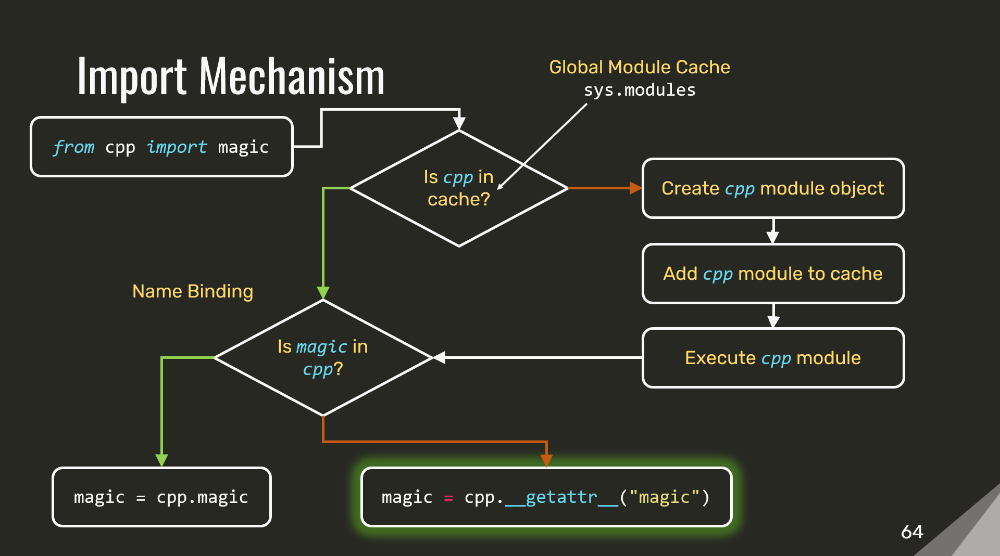

_Writeup of my talk about the [cpppy library](https://github.com/tmr232/cpppy)_

A few years ago I [gave a talk](https://www.youtube.com/watch?v=U74sqQGqZzk) about implementing C++ semantics (namely, destructors) in Python.
After giving the talk, I published my [speaker notes and slides](https://github.com/tmr232/talks/tree/main/CoreCpp2021), to make it as accessible as possible, even to people who don't wanna watch a video.
I was quite pleased with myself, until a few weeks ago when I wanted to look up a detail so that I can reference it in a new blogpost.
I went to the speaker notes, started reading, and oh. Oh no.
I could get through it, but it really doesn't hold up on its own despite my memory of it being "everything I said during the talk".
That's quite unfortunate, as I am very pleased with the work I done for this talk, and want people to happen upon it.
Which brings us here - this is that talk, but as a blogpost.

## But Why?

When coming to implement C++ semantics in Python, the first question we need to ask ourselves is "why?".
Why would we want to take anything (other than performance) from C++ into Python?
After all, C++ is a low-level language, mostly "expert oriented", and is slowly becoming more "Pythonic".
And on the other hand, Python is a high-level language, it is beginner friendly, and has far fewer footguns than C++.

The answer to that question is resource-management.
In C++, all resources are handled the same way.
Be it allocated memory; a file; a lock; or your own resource - they are all handled using the same mechanism.
In Python, on the other hand, different resources are handled differently.
While memory is managed for you by the garbage collector, all other resources must be managed by the programmer.

Before you say anything - no.
Python is not C.
We don't have to call the cleanup functions manually.
Instead, Python gives us context managers.

### Context Managers

Context-managers are relatively straight-forward.
To use them, we use the `with` statement as follows:

```python
with FileReader(path) as f:
    print(f.read())
```

Then, the language uses our `FileReader` object to wrap the indented block, roughly as follows:

```python
_tmp = FileReader(path)
f = _tmp.__enter__()
try:
	print(f.read())
except:
	if not _tmp.__exit__(<exception info>):
		raise
finally:
	_tmp.__exit__(<None exception info>)
```

Before entering the indented block, we create our `FileReader` and call its `__enter__` method.
Then, we run the contents of the block.
Then, on leaving the block, we call `__exit__`.
If an exception was raised from the block, we'll get the exception info and have a choice to either silence it (by returning a `True` value) or re-raise it (by returning `False`).
If no exception was raised - we'll get get no exception information.

To define a context manager, all we have to do is add an `__enter__` method and an `__exit__` method to our class:

```python
class FileReader:
    def __enter__(self):
        return self

    def __exit__(self, exc_type, exc_val, exc_tb):
        self.close()

    ...
```

### Real Code

This is well and nice, but let's look at some real code, a redacted version of something we had running in production:

```python
class ArchiveReader:
    def __init__(self, path: str):
        self.data = {}
        with ZipFile(path) as zipfile:
            for name in zipfile.namelist():
                with zipfile.open(name) as f:
                    self.data[name] = f.read()

    def read(self, name):
        return self.data[name]
```

We had a zip file containing many small files.
So to make reading fast and simple, we read _all_ the files into memory when initializing the reader.
Then, when we needed a specific file - we just accessed it in the `data` dict.
This way we only unzip once, which was a significant performance gain.

The usage of the class was also very straightforward:

```python
reader = ArchiveReader("corecpp.zip")
print(reader.read("2021"))

# Prints:
# Hello, CoreC++!
```

We were fairly pleased.

But, as time went by, we ran into issues.
The data files we were reading changed from being tiny (<10MiB) to huge (>5GiB).
As a result, we could no longer keep the files unzipped in memory.

The "easy" solution would keep the path, and open the zip file whenever we read a file, unzipping only the desired file.
This works, but due to the need to parse zip metadata, it adds a significant overhead in execution time.

The solution we went with was to create the `ZipFile` object (thus parsing the metadata) and hold it in our `ArchiveReader` class.
Then, when we read a file, we open and unzip only the said file:

```python
class BigArchiveReader:
    def __init__(self, path: str):
        self.zipfile = ZipFile(path)

    def read(self, name: str):
        with self.zipfile.open(name) as f:
            return f.read()
```

Unfortunately, now that we hold a `ZipFile` object, we need to manage it.
To do that, we had to make our archive reader a context-manager:

```python
class BigArchiveReader:
    ...

    def __enter__(self):
        return self

    def __exit__(self, exc_type, exc_val, exc_tb):
        self.zipfile.close()
```

Which, in turn, changes the usage of our reader:

```python
with BigArchiveReader("corecpp.zip") as big_reader:
	print(big_reader.read("2021"))
```

In turn, this demonstrates a bigger issue.
Holding a context manager as a member changes the interface of our objects, forcing them to be context managers as well.
This change propagates up to all respective owners, and up the stack to the point where the top-level object is created.
As this is a breaking change, we must be able to change the code that uses our object.
In the general case, this is not possible.

### C++ Destructors

C++, however, has a solution to those issues - destructors.
Destructors are what makes C++ resource management work, and they have 3 key properties we're interested in.
They are:

1. Automatic
2. Composable
3. Implicit.

#### Automatic Invocation

The invocation of a destructor is automatic.
When we leave a scope, they are called automatically, no matter how we leave the scope.

```c++
{
    auto reader = FileReader(path);
    
    std::cout << reader.read() << '\n';
} // <-- The destructor is called here!
```

#### Seamless Composition

Destructors of member fields are called automatically, making composition easier.
If we add a new member, we know that it's destructor will be called when it is needed.

```c++
class ArchiveReader {
    ...
};

...

    auto reader = ArchiveReader(path);
} // <-- Destructor is called!
  //         ~ArchiveReader();
```

```c++
class BigArchiveReader {
    ZipFile zipfile;
    ...
};

...

    auto big_reader = BigArchiveReader(path);
} // <-- Destructor is called!
  //         ~BigArchiveReader();
  //     Followed by member destructor:
  //         ~ZipFile();
```

#### Implicit Interfaces

Last but not least - destructors are implicit in object interfaces.
Objects with user defined destructors and objects without them are all used the same way.

```c++
// Object with no destructor
{
	auto object = ObjectWithoutDtor();
}

// Object with destructor
{
	auto object = ObjectWithDtor();
}
```

This is even if we don't define them, they always exist, for all objects.
This means that when we write our own destructors, our interfaces don't change, and no change is propagated.

### Our Goal

With that in mind, we want to bring destructors from C++ to Python.
Converting our archive reader from this (11 lines of code, 4 are dedicated to resource management):

```python
class BigArchiveReader:
    def __init__(self, path: str):
        self.zipfile = ZipFile(path)

    def read(self, name: str):
        with self.zipfile.open(name) as f:
            return f.read()

    def __enter__(self):
        return self

    def __exit__(self, exc_type, exc_val, exc_tb):
        self.zipfile.close()
```

To this (7 lines of code, 0 dedicated to resource management):

```python
class BestArchiveReader:
    zipfile: ZipFile
    def __init__(self, path: str):
        self.zipfile = ZipFile(path)

    def read(self, name: str):
        with self.zipfile.open(name) as f:
            return f.read()
```

And ensure that our usage remains the same as the original `ArchiveReader`, with no context-managers and no interface pollution:

```python
reader = BestArchiveReader("corecpp.zip")
print(reader.read("2021"))
```

#### Don't Try This At Work

Seriously, just don't.

It's all fun, and standard, and truly painful in a code review or debugging session.

With that in mind, let's start!

# Implementing C++ Destructors in Python

## Automatic

Since our target class is a bit complicated, we'll be joined in our implementation
journey by a simple class called `Greeter`.
The greeter is a simple class.
It takes a name on construction, and says "Hello".
On destruction, it says "Goodbye"

This will allow us to keep track of ctors and dtors as we progress through this post.

```python
class Greeter:
    def __init__(self, name):
        self.name = name
        print(f"Hello, {self.name}!")

    def close(self):
        print(f"Goodbye, {self.name}.")


def main():
    greeter = Greeter(1)
    print("We have a greeter!")
    greeter.close()

main()
```

```
Hello, 1!
We have a greeter!
Goodbye, 1.
```

Our first implementation is as straight-forward as can be.
With a constructor and a "close" method to act like our dtor.

The next step is pretty straight-forward.
Since Python already provides us with context-manages and the `with` statement, we'll use them and see where it gets us.

```python
class Greeter:
    def __init__(self, name):
        self.name = name
        print(f"Hello, {self.name}!")

    def __enter__(self):
        return self

    def __exit__(self, exc_type, exc_val, exc_tb):
        print(f"Goodbye, {self.name}.")
        return False


def main():
    with Greeter(1):
        print("We have a greeter!")

main()
```

```
Hello, 1!
We have a greeter!
Goodbye, 1.
```

### Stacking Dtors

What if we want more than one `Greeter`? No problem!
Just stack the context-managers!

```python
def main():
    with Greeter(1):
        print("First")
        with Greeter(2):
            print("Second")


main()
```

```
Hello, 1!
First
Hello, 2!
Second
Goodbye, 2.
Goodbye, 1.
```

Then again, this type of nesting can get unwieldy quick.
We need something better.

Since we're already stacking context-managers, we can use a proper stack:

```python
class DtorScope:
    def __init__(self):
        self.stack = []

    def __enter__(self):
        return self

    def __exit__(self, exc_type, exc_val, exc_tb):
        while self.stack:
            self.stack.pop().__exit__(exc_type, exc_val, exc_tb)

    def push(self, cm):
        self.stack.append(cm)
```

The `DtorScope` will hold all of our `Greeter` objects in place, then call their `__exit__` methods when we leave the `with` context:

```python
def main():
    with DtorScope() as dtor_stack:
        greeter1 = Greeter(1)
        dtor_stack.push(greeter1)

        greeter2 = Greeter(2)
        dtor_stack.push(greeter2)


main()
```

```
Hello, 1!
Hello, 2!
Goodbye, 2.
Goodbye, 1.
```

And with that, we've rid ourselves of the nesting issue.
It works, destruction is automatic, it's fairly straight-forward, and all too explicit.

## Implicit

Now that our destructors get called automatically on scope exit, we want to
make sure that we don't need to write any code to make it happen.

If we could, we'd like our function to look like this:

```python
def main():
    greeter1 = Greeter(1)
    greeter2 = Greeter(2)
```

And have it implicitly do all the plumbing we managed earlier.

First, since we always want to push our objects onto the dtor stack, let's
make it part of their construction.

```python
class Greeter:
    def __init__(self, name, dtor_stack):
        dtor_stack.push(self)

        self.name = name
        print(f"Hello, {self.name}!")


    def __enter__(self):
        return self

    def __exit__(self, exc_type, exc_val, exc_tb):
        print(f"Goodbye, {self.name}.")
        return False


def main():
    with DtorScope() as dtor_stack:
        greeter1 = Greeter(1, dtor_stack)
        greeter2 = Greeter(2, dtor_stack)


main()
```

That's a good start.
We can no longer forget to push our greeters onto the `DtorScope`, and we saved a couple of lines.

That said, we're explicitly repeating and passing around a construct that should be implicit.

To pass the `dtor_stack` implicitly to the `Greeter` class, we need to store it _somewhere_.
In our case, we'll use a global variable!
And just like function calls go into a stack so that we know where to return, so will our `DtorScope`s.
So instead of a single global variable, we'll have to use a global stack.

```python
_dtor_stack = []


def get_dtor_stack():
    return _dtor_stack


class DtorScope:
    def __init__(self):
        self.stack = []
        # Push current scope onto global scope stack
        get_dtor_stack().append(self)

    def __enter__(self):
        return self

    def __exit__(self, exc_type, exc_val, exc_tb):
	    # Pop current scope from global scope stack
        get_dtor_stack().pop()

        while self.stack:
            self.stack.pop().__exit__(exc_type, exc_val, exc_tb)

    def push(self, cm):
        self.stack.append(cm)


def push_dtor(cm):
    return get_dtor_stack()[-1].push(cm)
```

This is the same as our previous dtor-scope, but now we keep a global stack of scopes.
This allows us to always tell which dtor-stack to push our instances into without naming the stack.

```python

class Greeter:
    def __init__(self, name):
        self.name = name
        print(f"Hello, {self.name}!")

        # Push the greeter onto the current dtor-scope
        push_dtor(self)

    def __enter__(self):
        return self

    def __exit__(self, exc_type, exc_val, exc_tb):
        print(f"Goodbye, {self.name}.")
        return False


def main():
    with DtorScope():
        greeter1 = Greeter(1)
        greeter2 = Greeter(2)

main()
```

Much better, but we still need to explicitly create the scope inside every function.

### Decorators

However, since the dtor scoping mechanism has nothing to do with the function itself, we can use it at the callsite instead of inside the function, and it'd work exactly the same.

```python
def main():
    greeter1 = Greeter(1)
    greeter2 = Greeter(2)

with DtorScope():
    main()
```

This will have to be done on _every_ callsite, so we add a utility function
to help with that.

The `*args, **kwargs` syntax is there to pass along any and all function arguments unchanged. Think of it as Python's version of perfect-forwarding.

```python
def call(f, *args, **kwargs):
    with DtorScope():
        return f(*args, **kwargs)

call(main)
```

Alternatively, we can take the function and return a closure that includes the scoping.

```python
def cpp_function(f):
    def _wrapper(*args, **kwargs):
        with DtorScope():
            return f(*args, **kwargs)
    return _wrapper

scoped_main = cpp_function(main)

scoped_main()
```

Inside `_wrapper` we capture `f` from the parent scope.
As Python is reference-based, we don't need to specify how to capture.

Next, since Python is dynamic, we can replace the original `main` function with the scoped one.

```python
def main():
    greeter1 = Greeter(1)
    greeter2 = Greeter(2)

main = cpp_function(main)

main()
```

Here the wrapper holds the previous version of the function, while the name `main` is bound to the wrapped version.

In Python, wrapping a function and replacing its original is a common operation.
Because of that, we have some syntactic sugar called "decorators".

```python
@cpp_function
def main():
    greeter1 = Greeter(1)
    greeter2 = Greeter(2)

main()
```

This is functionally equivalent to the previous snippet, but is cleaner and more expressive.
And with that, the _inside_ of `main` looks the way we want it.

### Import Hacks

We still have a problem, though.
Even if `main` looks nice, we had to decorate it with `cpp_function`.
Having to do that to every function we write for it to work is not very "implicit", is it?

What if instead, we could just write `from cpp import magic`, and have that "magic" decorate our functions for us?

```python
from cpp import magic

def main():
    greeter1 = Greeter(1)
    greeter2 = Greeter(2)
```

Nice, isn't it? So let's get to it!

#### The Magic Function

As a first step, we'll call a function at the end of our module to decorate everything:

```python
from cpp import magic

from greeter import Greeter

def main():
    greeter1 = Greeter(1)
    greeter2 = Greeter(2)

magic()

main()
```

Our `magic()` function needs to do 2 things:

- Get the module it was called in;
- and decorate all the functions.

```python
def magic():
    calling_module = get_calling_module()
    decorate_module_functions(calling_module)
```

To get the calling module, we use `inspect.stack` to traverse the callstack and find the right module

```python
import inspect

def get_calling_module():
    # Use 2 here because we need to go 2 frames up.
    stack_frame = inspect.stack()[2].frame
    module = inspect.getmodule(stack_frame)
    return module
```

We get the callstack, take the frame 2 level above us (the caller to `magic()`), and use `inspect.getmodule` to get the relevant module.

Then we decorate our functions.

```python
def decorate_module_functions(module):
    for name, value in inspect.getmembers(module):
        if not inspect.isroutine(value):
            continue

        # Only convert functions that were defined in the importing file.
        # We don't want to convert library imports and the likes of those.
        if inspect.getmodule(value) != module:
            continue

        setattr(module, name, cpp_function(value))
```

Our function takes a module and modifies it.

To do this, we're using some of Python's reflection capabilities.
`inspect.getmembers(obj)` returns all the member variables of a given object.
In our case - a module.
`inspect.isroutine(obj)` tells us whether a value is a function.
`inspect.getmodule(obj)` returns the module an object was defined in.
`setattr(obj, name, value)` sets an object attribute named `name` to `value`.

And with that our `magic()` function is operational!

For our next trick, we'll make the call to magic() disappear as well.
This means that we need to somehow make the `from cpp import magic` line
do the actual magic.

"But Tamir! An import is not a function call!" you might say.
Well, let's see what a Python import actually does.

#### Import Internals

When we run `from cpp import magic` we go through the following steps.



First, we look for a module named `cpp` in the global module cache,
`sys.modules`.
If it is present, the module is already loaded, and we can skip to name binding.

If it is not present in the cache, we find it on disk, create a module object from it, place the module object in the cache, and then execute the module.

Note that we first store it in the cache, and only then execute the module.
This is important as Python allows for cyclic imports, and we want to avoid recursion.
It will also come in handy later.

Once we finish executing the module, we need to bind the relevant names.
In this case - `magic`.

Python takes the `cpp` module from `sys.modules` and looks for `magic`
inside it.
If it finds it, it binds that to the name `magic`.

Lastly, Python modules may define a `__getattr__(name)` function.
If it is defined, it is called whenever we try to import a name that isn't present in the module.

```python
magic = cpp.__getattr__("magic")
```

So, as you can see - `import` _can_ be a function call!

```python
def _magic():
    calling_module = get_calling_module()
    decorate_module_functions(calling_module)

def __getattr__(name):
    if name != "magic":
        raise AttributeError()

    _magic()
```

This converts the import to a call and allows C++ to work it's magic.

```python
from cpp import magic

from greeter import Greeter

def main():
    greeter1 = Greeter(1)
    greeter2 = Greeter(2)

main()
```

Well, almost...

You see, since we're imported on the first line of the module, the module is empty.
The functions we want to decorate are not yet defined.
To fix this, we can do one of two things.

The first option is to import our magic at the end of the file

```python
from greeter import Greeter

def main():
    greeter1 = Greeter(1)
    greeter2 = Greeter(2)

from cpp import magic

main()
```

This works, but feels far from magical.

The other option, then, is to import the modules ourselves!
With the fully imported module at hand, we can modify it as we wish.

#### Import Cycles

This means that our `_magic()` function is going to change a little:

```python

import importlib.util
import sys

def import_by_path(name: str, path: str):
    spec = importlib.util.spec_from_file_location(name, path)
    module = importlib.util.module_from_spec(spec)
    sys.modules[name] = module
    spec.loader.exec_module(module)
    return module


def _magic():
    calling_module = get_calling_module()
    name = calling_module.__name__
    path = calling_module.__file__
    imported_module = import_by_path(name, path)
    decorate_module_functions(imported_module)
```

Using Python's import mechanisms, we import another instance of the
module that imported us.

We use it's name and path to import it again, then store it in the
global module cache instead of the original.

This is where the fact that the cache is filled _prior_ to module execution
comes in handy!

We execute the module, to define all the types,
and then decorate the functions.

With this change, we can now write the import at the top again:

```python
from cpp import magic

from greeter import Greeter

def main():
    greeter1 = Greeter(1)
    greeter2 = Greeter(2)

main()
```

And recurse infinitely.

Our module runs the `magic()` function.
The `magic()` function imports our module.
The module runs the `magic()` function.
The `magic()` function imports our module.

And so on and so forth.

To fix that, we add a flag to all the modules we import, before executing them.
Then, in our `magic()` function, we check for the flag.

```python
IMPORT_FLAG = "__magically_imported__"

def import_by_path(name: str, path: str):
    spec = importlib.util.spec_from_file_location(name, path)
    module = importlib.util.module_from_spec(spec)
    sys.modules[name] = module
    setattr(module, IMPORT_FLAG, True)
    spec.loader.exec_module(module)
    return module


def _magic():
    calling_module = get_calling_module()
    name = calling_module.__name__
    path = calling_module.__file__
    if hasattr(calling_module, IMPORT_FLAG):
        return

    imported_module = import_by_path(name, path)

    decorate_module_functions(imported_module)
```

This breaks the recursion, but we still have an issue.

Once we finish all of our import magic, we return to the module that triggered the magic.
This module has not yet been modified.
Once we return to it, it'll run to completion.
In the case of our main module - `main()` will run twice.
First, when we import it inside `magic()`.
Second, when we return to the main module and let it execute.
In both cases, we'll be running the non-decorated version.
This is not at all what we want.

To avoid this sort of thing, Python code usually uses the following:

```python
if __name__ == "__main__":
    main()
```

`__name__` always holds the name of the current module.
In the case of the main module, it'll be `"__main__"`.

This ensures that when a module is imported (and used as a library) it will not run the `main()` function.

In our case, this will not be enough.
First, we actually do import the module.
Second, we need to ensure that once we're done, the original doesn't run.

So once again, we modify our magic function!

```python
def _magic():
    calling_module = get_calling_module()
    name = calling_module.__name__
    path = calling_module.__file__
    if hasattr(calling_module, IMPORT_FLAG):
        return

    imported_module = import_by_path(name, path)

    decorate_module_functions(imported_module)

    if imported_module.__name__ == "__main__":
        sys.exit(imported_module.main())
```

Instead of _preventing_ `main()` from running, we call it explicitly.
That means that, like in C++ code, we don't need to call `main()` explicitly in our code.

```python
from cpp import magic

from greeter import Greeter

def main():
    greeter1 = Greeter(1)
    greeter2 = Greeter(2)

```

When we're done, we call `sys.exit` to terminate the process, and never actually reach the module that initially imported us.

### Class Boilerplate

Another thing we want to address is the code inside our `Greeter`.
We are currently writing a lot of boilerplate there.
We have the `__enter__` method, the unused `__exit__` arguments, and pushing
the instance into the dtor stack.

With a bit of inheritance, we can move all that boilerplate out of `Greeter`.

```python
from cpp import magic


class CppClass:
    def __init__(self, *args, **kwargs):
        push_dtor(self)

        ctor = getattr(self, self.__class__.__name__, None)
        if ctor:
            ctor(*args, **kwargs)

    def __enter__(self):
        return self

    def __exit__(self, exc_type, exc_val, exc_tb):
        dtor = getattr(self, "_" + self.__class__.__name__, None)
        if dtor:
            dtor()


class Greeter(CppClass):
    def Greeter(self, name):
        self.name = name
        print(f"Hello, {self.name}!")

    def _Greeter(self):
        print(f"Goodbye, {self.name}.")


def main():
    greeter1 = Greeter(1)
    greeter2 = Greeter(2)
```

That's great.
Now as we add more classes, we don't need to handle all that annoying dtor-stack stuff.
As a bonus - our constructor is now named `Greeter`, as it would be in C++; and our destructor is `_Greeter`, as `~` is not valid in Python identifiers.

But... We're still missing something.
We decorated all free functions with `cpp_function`, but we still need to decorate all of our member functions.

```python
def decorate_object_methods(obj):
    for name, value in inspect.getmembers(obj):
        # Ignore magic methods
        if name.startswith("__"):
            continue

        if not inspect.isroutine(value):
            continue

        setattr(self, name, cpp_function(value))


class CppClass:
    def __init__(self, *args, **kwargs):
        push_dtor(self)

        decorate_object_methods(self)

        ctor = getattr(self, self.__class__.__name__, None)
        if ctor:
            ctor(*args, **kwargs)

    def __enter__(self):
        return self

    def __exit__(self, exc_type, exc_val, exc_tb):
        dtor = getattr(self, "_" + self.__class__.__name__, None)
        if dtor:
            dtor()

```

This is similar to what we did with the modules, but this time we check for magic methods, as we don't wanna decorate them.

Last but not least - we want to make it truly implicit.

Currently, we use inheritance explicitly to extend our `Greeter` class with the `CppClass` methods.
In essence, we're injecting 3 methods into our `Greeter` class - `__init__`, `__enter__`, and `__exit__`.
We're using inheritance, but we can use a decorator just as well.
We take the class, make the relevant modifications, then return the modified version.

```python
def cpp_class(cls):

    def __init__(self, *args, **kwargs):
        ...

    def __enter__(self):
        ...

    def __exit__(self, exc_type, exc_val, exc_tb):
        ...

    cls.__init__ = __init__
    cls.__enter__ = __enter__
    cls.__exit__ = __exit__

    return cls


@cpp_class
class Greeter:
    ...
```

This might look a bit funky, but it integrates well with our previous work decorating all free functions.

A few extra touches are moving the method decoration out of the `__init__` method, so that it only happens once; and adding a `__cpp_class__` attribute so that our code can tell it's actually a C++-style class.

```python

def cpp_class(cls):
    decorate_object_methods(cls)

    def __init__(self, *args, **kwargs):
        ...

    def __enter__(self):
        ...

    def __exit__(self, exc_type, exc_val, exc_tb):
        ...

    cls.__init__ = __init__
    cls.__enter__ = __enter__
    cls.__exit__ = __exit__
    cls.__cpp_class__ = True

    return cls


@cpp_class
class Greeter:
    ...
```

Lastly, we modify `_magic` to decorate classes as well:

```python
def decorate_module_classes(module):
    for name, value in inspect.getmembers(module):
        if not inspect.isclass(value):
            continue

        # Only convert functions that were defined in the importing file.
        # We don't want to convert library imports and the likes of those.
        if inspect.getmodule(value) != module:
            continue

        setattr(module, name, cpp_class(value))


def _magic():
    ...
    decorate_module_classes(module)
    ...
```

And with that, are classes are automatically converted to C++ classes!

```python
from cpp import magic

class Greeter:
    def Greeter(self, name):
        self.name = name
        print(f"Hello, {self.name}!")

    def _Greeter(self):
        print(f"Goodbye, {self.name}.")

def main():
    greeter1 = Greeter(1)
    greeter2 = Greeter(2)
```

## Composable

We've come a long way so far, and our destructors are called automatically and implicitly.
The next step is making our classes composable.
Or, more specifically - handling members properly.

Before we do that, let's see where we are now:

```python
class BetterArchiveReader:
    zipfile: ZipFile # This is a type annotation, it does nothing.

    def BetterArchiveReader(self, path: str):
        self.zipfile = ZipFile(path)

    def read(self, name: str):
        with self.zipfile.open(name) as f:  # Resource management
            return f.read()

    def _BetterArchiveReader(self):
        self.zipfile.close()  # More resource management
```

We have fewer lines, and fewer resource-management lines.
That's great.
But we also have a new issue - double free!
When we create the `ZipFile` object, it gets pushed into the dtor-scope of the `BetterArchiveReader` ctor.
Later, when we get to the dtor and call `.close()` on it, it is already closed!

To fix that, we need to somehow remove the `ZipFile` from the function scope, and let the `BetterArchiveReader` handle it instead.
So something like:

```python
class BetterArchiveReader:
    ...

    def BetterArchiveReader(self, path: str):
        self.zipfile = ZipFile(path)
        remove_dtor(self.zipfile)

    ...
```

Which would call a `.remove` method on the current `DtorScope`:

```python
class DtorScope:
    stack: list
    ...
    def remove(self, cm):
        self.stack.remove(cm)
```

Which will, unfortunately, fail.
`list.remove()` checks for equality, not identity.
So if we have multiple object that compare equal - we're in for some painful debugging.
To remedy this, we'll borrow a trick from the C++ playbook and use a comparison object:

```python
class IdentityComparator:
    def __init__(self, obj):
        self.obj = obj

    def __eq__(self, other):
        return self.obj is other


class DtorScope:
    ...
    def remove(self, cm):
        self.stack.remove(IdentityComparator(cm))

def remove_dtor(cm):
    get_dtor_stack()[-1].remove(cm)
```

`IdentityComparator` wraps the object we provide, replacing the equality check with an identity check, resolving the issue.

And while `ZipFile` _does_ have a `.close` method, not all context-managers do.
So we'll make our code a bit more generic with a call to `__exit__`:

```python
...
    def _BetterArchiveReader(self):
        self.zipfile.__exit__(None, None, None)
```

That's better, but we're back to managing the dtors of our objects manually again.
Instead, we want assignment to a class member to handle all that automatically.

### Descriptors

Unlike C++, Python does not have any form of assignment operators.
So we can't use those.
It does, however, have setters and getters.
Before we dive into that bit of syntax, let's look at what we want them to do:

```python
def is_cpp_class(cls):
    # Use the flag we set earlier to detect C++ classes
    return getattr(cls, "__cpp_class__", False)

def get_zipfile(self):
	# Nothing to do on get - the class maintains ownership.
    return getattr(self, "zipfile")


def set_zipfile(self, zipfile):
    old = getattr(self, "zipfile", None)

	# If the old object a C++ class, we destruct it
    if is_cpp_class(old):
        old.__exit__(None, None, None)

	# Then we remove the new object from the scope of the
	# function it was assigned in.
    if is_cpp_class(zipfile):
        remove_dtor(zipfile)

    setattr(self, "zipfile", zipfile)
```

Naturally, we don't wanna be writing and calling those methods everywhere.
To circumvent that, we'll use "descriptors", Python's flavour of getters and setters.

Any _class_ member variable (class, not instance) that implements `__set__` and `__get__` is a descriptor.
When we later access those variables through an instance, those methods are called to set or get the value from the member.
Adjusting our code to use them, we get:

```python
class CppMember:
    def __set_name__(self, owner, name):
	    # Called on class creation
        self.private_name = "_" + name

    def __get__(self, instance, owner=None):
        # Called on an instance, when getting the value
        return getattr(instance, self.private_name)

    def __set__(self, instance, value):
        # Called on an instance, when setting the value
        old = getattr(instance, self.private_name, None)

        if is_cpp_class(old):
            old.__exit__(None, None, None)

        if is_cpp_class(value):
            remove_dtor(value)

        setattr(instance, self.private_name, value)

class Reader:
    # Create zipfile as a class member variable
    zipfile = CppMember()
    def Reader(self, path):
        self.zipfile = ZipFile(path)
```

`__set_name__` is another descriptor method.
It is called on class creation (when Python creates the _class_ object, not an instance) to pass the variable name to the descriptor.
Then, the descriptor can derive a unique name from it and use it to store the actual value in the instance.

This takes care of the function-scope.
The next thing to do is make sure when our destructor is called, we call all the member destructors as well.
So in `cpp_class`, we add a call the member destructors after dealing with the class destructor.

```python
def __exit__(self, exc_type, exc_val, exc_tb):

    ...  # Handle class dtor first

    # Then handle member dtors in reversed definition order
    for name, value in reversed(inspect.getmembers(self)):
        if name.startswith("_"):
            continue

        if not is_cpp_class(value):
            continue

        value.__exit__(None, None, None)

```

This leaves us with much nicer code:

```python
class BetterArchiveReader:
    zipfile = CppMember()

    def BetterArchiveReader(self, path):
        self.zipfile = ZipFile(path)

    def read(self, name: str):
            ...

```

We just assign a `ZipFile` to a member, and we're good to go.
Our member destructors are called automatically.

### Annotations

But... That `zipfile = CppMember()` still bothers me.
It shows some plumbing that is better hidden.
And we can do better.

Python has type annotations.
They look something like:

```python
class SomeClass:
    name: SomeType
```

They don't really do anything, but once we use them, Python stores a mapping between `name` and `SomeType` inside our `SomeClass` object.
And if we have a mapping, we can query it:

```python
def create_members(cls):
    # Query the the member variable annotations for the given class
    member_names = list(getattr(cls, '__annotations__', {}))

    for name in member_names:
	    # Create a new CppMember Descriptor object
        member = CppMember()
        # Since we're modifying an already-created class,
        # we need to call `__set_name__` manually here
        member.__set_name__(cls, name)
        # Assign the newly created descriptor to the class member.
        setattr(cls, name, member)

    # This will be useful later
    setattr(cls, '__member_names__', member_names)

def cpp_class(cls):
    ...
    create_members(cls)
    ...

	def __exit__(self, exc_type, exc_val, exc_tb):

	    ...
	    # We have a list of all members now, so no need
	    # to use reflection to get it.
	    for name in reversed(self.__member_names__):
	        value = getattr(self, name, None)

	        if is_cpp_class(value):
	            value.__exit__(None, None, None)
```

And with that, we've reached our goal!
We can now write our `BestArchiveReader` as if it was a C++ class:

```python
class BestArchiveReader:
    zipfile: ZipFile

    def BestArchiveReader(self, path: str):
        self.zipfile = ZipFile(path)

    def read(self, name: str):
        with self.zipfile.open(name) as f:
            return f.read()
```

## Wrapping Up

We started by looking at Python's take on destructors, and the issues it poses.
Then, we took inspiration from C++ and gradually built a "better" solution.
We focused on 3 main goals, and achieved them:

1. Automatic: destructors are called when / where they are needed.
2. Composable: members work automatically, with no added boilerplate.
3. Implicit: no extra code; no changes to interfaces; no interface pollution.

### But...

Some of you may have noticed a glaring issue.
Once a value is created in a function, or assigned to a member variable - we can no longer move it.
See, we have ownership, but no move semantics.

There are some extra tricks we can use (and are used in the library) for returning values, but I don't think the general case is elegantly solvable.

## Further Reading

First, thank you for reading this entire post.
If you want to play with the concepts I presented here, check the full implementation, you can check it out [on my Github](https://github.com/tmr232/cpppy).
You'll also find there an implementation of access specifiers, which you're sure to enjoy.

This was a fun experiment when I first started playing with this, and a fun talk to present.
I hope you have fun with this too.
