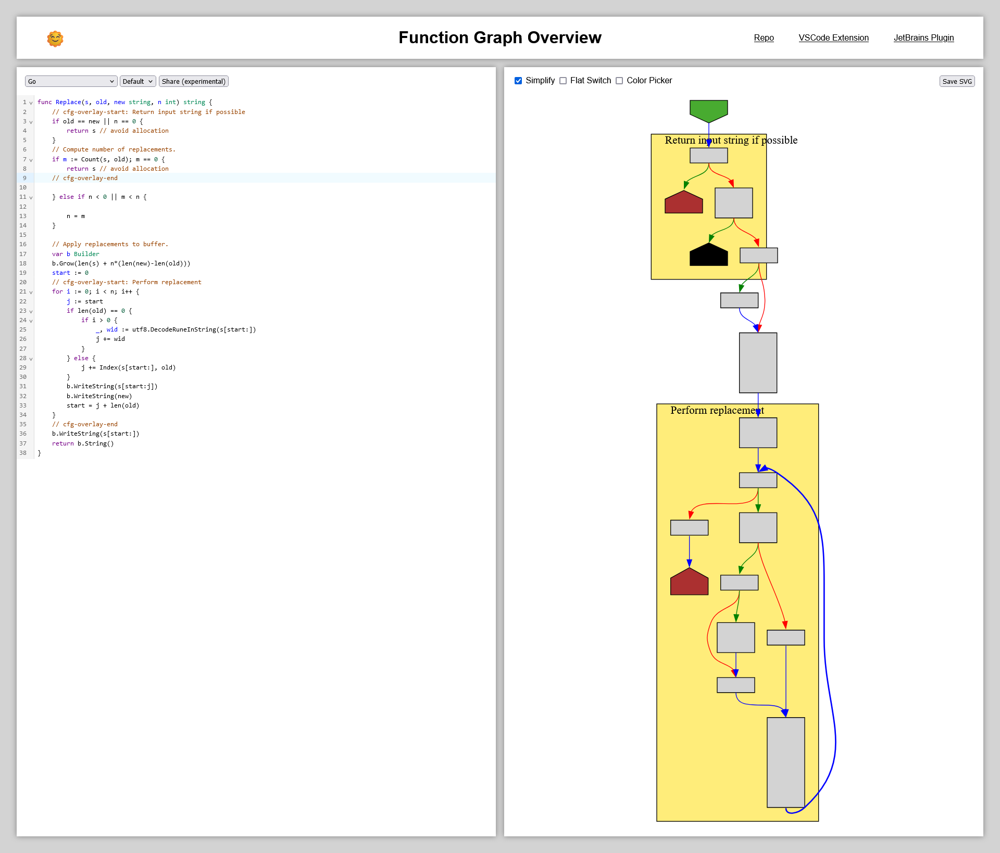
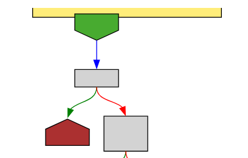
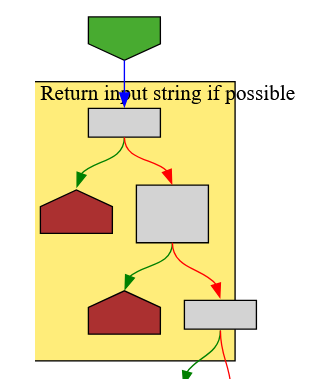
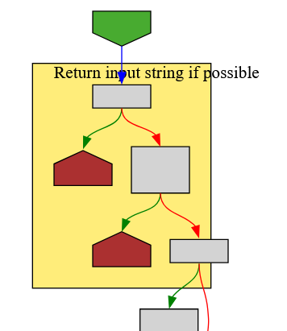

I usually think of [SVGs](https://en.wikipedia.org/wiki/SVG) as a "simple" graphical files, but that's probably because I never had to edit them programmatically.

I am [currently working](https://github.com/tmr232/function-graph-overview/pull/63) on adding overlay-notes to [Function Graph Overview](https://tmr232.github.io/function-graph-overview/).
The idea is that you use start- and end-comments in your code to define a region, and have that region reflected in the graph as a block surrounding the relevant nodes.
Hopefully, this will allow better understanding, as whole regions of the graph can now be labelled.


While the project uses [Graphviz DOT](https://graphviz.org/) to define and render the graphs themselves, I decided to add the overlay-notes via post-processing to minimize their effect on graph layout[^clusters].

This means I need to take the SVG output from Graphviz, and "just" add the new graphics to it.
This involves a couple of steps:

1. Determine the position and size of the notes
2. Add them to the SVG

### Positioning our Notes

One of the wonderful things about SVGs is that they can contain non-visual metadata.
Specifically - when exporting to SVG, Graphviz can [export node-IDs as SVG `id` attributes](https://graphviz.org/docs/outputs/#ID) which we can access programmatically, matching the visual nodes with the CFG nodes we used to create them.

I use [svg.js](https://github.com/svgdotjs/svg.js) to: get the graphical node positions; find their bounding-box; create the graphics and insert them into the SVG at the wrong place entirely.


### SVG Transforms

You see, SVG elements can have a [`transform` attribute](https://developer.mozilla.org/en-US/docs/Web/SVG/Attribute/transform), similar to a CSS `transform`, changing their position in the document.
And Graphviz does indeed use them when exporting graphs[^graphviz-svg-transforms].
To correct for this, we copy the transform from the graph element onto our new note elements:

```typescript
note.transform(graph.transform());
```

And get our next problem:


### SVG Viewbox

SVG separates document-space from user-space.
All of our graphical elements are positioned in document-space, and then we use a [viewbox](https://developer.mozilla.org/en-US/docs/Web/SVG/Attribute/viewBox) to specify the user's view into the document.

We've just added new elements to the document, so we must adjust the viewbox to include them.
To do this, we calculate the bounding box of all our graphical elements (the graph _and_ the notes), manually apply the transformation to the bounding-box, and then adjust the viewbox.
But there's another little catch.

SVGs, like HTML, can use all sorts of units of length.
Graphviz uses `pt` for the `width` and `height` of the `svg` element, but neglects the units for everything else (defaulting to `px`).
This is a great choice by them, as it means the SVG can be specified and manipulated without considering units at all, then scaled using the `width` and `height`.
So to maintain the original rendered scale of the SVG, we take the final viewport `width` and `height` in `px`, and use that value as the SVG's new dimensions in `pt` (so if the viewbox is `(100px, 200px)`, the SVG will be `(100pt, 200pt)`).

### SVG Background

Now, there's one last thing to consider - the document background.
By default, any part of the SVG that does not display an element, is transparent.
This means that to have a solid background, we need to add an element with that color.
When we use the [`bgcolor` attribute](https://graphviz.org/docs/attrs/bgcolor/), Graphviz does this for us.
As Graphviz groups graphs in SVG `G` elements, it puts the background element into the graphs group.
This is all good behaviour, as it maintains a good SVG structure, but it is something we must consider when adding our notes.

First, we must make sure our notes end up between the graph elements themselves and the background.
For this purpose, we move the background element from the graph `G` to the top-level `SVG`.
Additionally, having changed the viewbox, we must scale the background element to fill it.

### ~~Text Wrapping~~



And with that, we're done[^text-wrapping].

[^clusters]: I tried using DOT clusters, but they impact the layout of the graph too significantly to be a real option.
[^graphviz-svg-transforms]: I don't know why they do it. But I definitely don't wanna rewrite that code, so I'll just be happy they give me high-quality outputs and document my findings.
[^text-wrapping]: Text-wrapping is not part of the SVG1.1 spec, so there is no easy fix here. To achieve it, we can either split it ourselves into lines; or embed an HTML `P` element inside the SVG. Preferably the first option.
