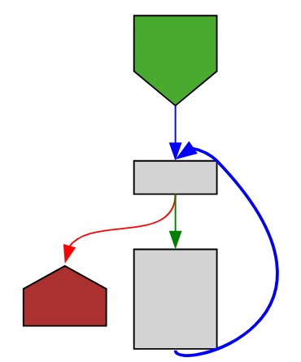
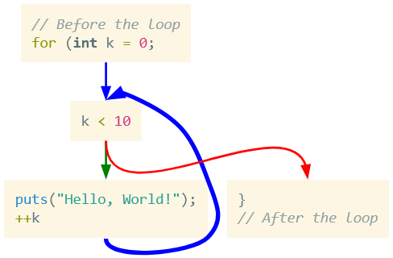

After creating [Function Graph Overview] some users suggested that I add the actual source code to the graphs.
I didn't particularly want to do that, feeling that it doesn't serve my goal with this project.
Additionally, I had no real idea on how to do it.
Not any practical idea, at least.

So, lacking ideas and lacking motivation, I mostly let it be.
But a couple of weeks ago I saw [`<foreignObject>`] mentioned somewhere and realized it can be used here.
A bit of work and experimentation, and the _mechanics_ are done (and available my [graphviz-embed] repo, including [a demo]).
It works by pre-calculating the size of the HTML elements you want to embed, and feeding it to Graphviz for the DOT rendering.
A [more complete explanation] is in the repo itself.

Why not in the actual project? Well...
While it works, technically, I could not figure out an attractive way to represent source code in the graph.
You see, when I create the graph-overview I have some artistic freedom.
Since there's no source-code displayed I can make changes similar to what a compiler does to get a better visual representation of the flow.
But with source-code these changes no longer look good.

Consider a C-style for-loop:

```c
for (int k = 0; k < 10; ++k) {
    puts("Hello, World!");
}
```

The [graph-overview for it](https://tmr232.github.io/function-graph-overview/?compressed=N4IgbgpgTgzglgewHYgFwEYA0IA2BDJAcwFc9CI0QBjEbKhAEwtXATgYAIIAPPAWwAOOCAAoAlB2AAdJBzkcAZgigcRcJABcO3DgF4OABgDc2jgB4O6YxwDUN7hOmz5LgcQ0wRUkAAkIOHARMDgB1ZRwGAEJvMSMZFwBfGQTaECVNAGU4AC9mEHQIPlT4QRw4BQBPNA0oYghsBXwNDIB3OA0qAAtq2vqQTrhCTrKhjTQFPBwYPvpA2DQAbVAkfjykRggAOiYJ4hwx7E6eSgBiBgBmC4uQBMxl1cp1pk2ITSgqw+OWE4AWAA4AIIAIXOBhudxAKz4aw2L247VSR24p2BoNB4Pu0MesI0nSgCBaiK+IBOCgUDApDAxkIeLCeWwqcH8VM+yO+BgMACMyQpqVCYc8NNA+Oo8EKiWySQB2ABMAFYAGxUBV82mQ2Gc5RMKAS04c-Vg26YgVbAZDEadA79YknA0c1VYlgQBjkTZQCAkfA61l6-Vkh15Z2u+hIaYARzqSCoFB97IMf31AcoQa2kyFUBWGjgkF13zJBqTLCoOGIMHTm01UG1uZJPJ5heoJbL0E2bVxNdJ5IY-qNNMdjdL5ZqFQAwghSsdYyTKd3eb3+ZRi4OW8OOxSyRSG0vm1BNgpRQEPtbJZ2N1T52rt+WeNGBFakacz5uL-3CFA8AJOhW8FQANZvhBiCQFlj0fOs5wAXQSIA) looks something like this:



Might take a minute to get used to, but it is clear and readable.

Now look at the same thing with source-code filled in:



This makes no sense.
We have the `for` header broken up and merged with the body and the lines before it in all sorts of weird ways.
Additionally, it's hard to make sense of a line out of context like this.

We might be able to get something clearer with clusters or other graphical elements, but I am not currently interested in pursuing this.
I will, however, be posting this in the [GitHub issue] for this, and if anyone comes up with a good representation, I'll be more than happy to integrate it.

In the meantime, you can copy my code[^copy] and use it in your own projects. 

[^copy]: I considered releasing an NPM package, but realized two things.
         One is that releasing a TypeScript NPM package is way more work than I anticipated, and the tutorials are bad.
         The second is that this is basically one function, and it makes no sense to have it as an opaque dependency
         when you can just copy it and adapt it to your needs.
         
[GitHub issue]: https://github.com/tmr232/function-graph-overview/issues/206
[Function Graph Overview]: https://tmr232.github.io/function-graph-overview/
[`<foreignObject>`]: https://developer.mozilla.org/en-US/docs/Web/SVG/Reference/Element/foreignObject
[graphviz-embed]: https://github.com/tmr232/graphviz-embed
[more complete explanation]: https://github.com/tmr232/graphviz-embed?tab=readme-ov-file#how-it-works
[a demo]: https://tmr232.github.io/graphviz-embed/
