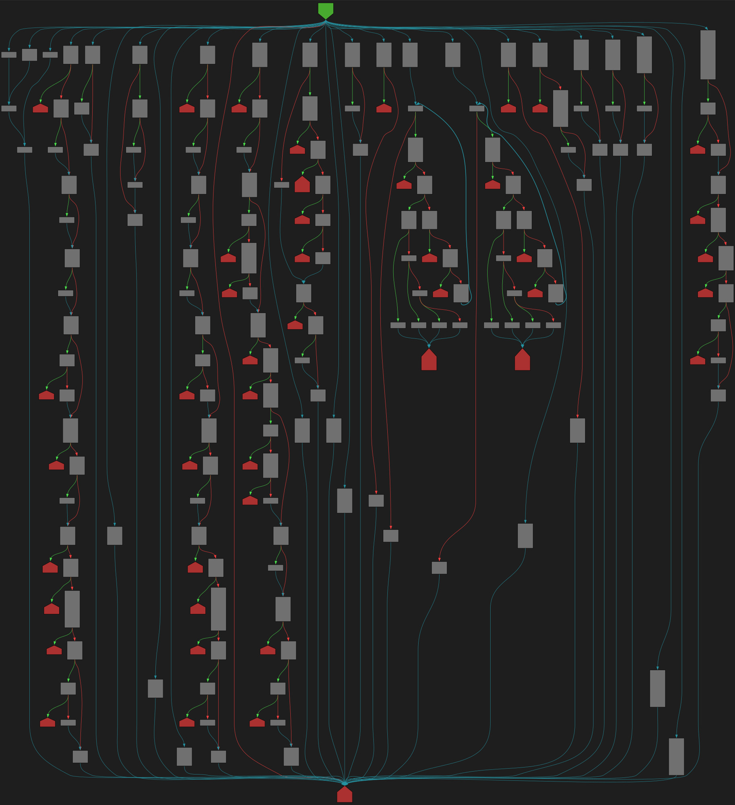

A few days ago I created [CFGBot](https://bsky.app/profile/cfgbot.bsky.social) - a small Bluesky bot that publishes hourly control-flow-graphs.

While technically simple, this bot is something I wanted to create for a few years now.
Originally, I wanted to write one that publishes [IDA Pro](https://hex-rays.com/ida-pro) graphs of random functions in system binaries.
But due to logistical issues (how to run a bot that uses software I'm only allowed to run on my own PC) and my concerns about copyright (can I freely post the disassembly of copyrighted software?) I never quite got around to it.

Despite those roadblocks, I kept wanting to share the visual wonder of control-flow-graphs with the world.

And a few days ago it dawned on me that now, after writing my [control-flow-graph generator](https://tmr232.github.io/function-graph-overview/), I can finally make this happen.
So I glued some pieces together, and here we are.

## A bit of internals

The core of the bot is the [function-graph-overview](https://github.com/tmr232/function-graph-overview/) project, used to generate the graphs themselves.
To choose what function to show every hour - I pre-process a corpus of source-code (currently - CPython's implementation and standard library, but more to come soon!) to get an index of all the functions in it.

The index contains basic information:

- Location of the function (filepath, location in the file)
- Number of CFG nodes
- The function definition (this accounts for overloads and anonymous functions better than function names)

Then, on every run, I randomly select a function, biased slightly towards higher node-counts, as those are more interesting.

I then render this function to a PNG image, and post to Bluesky.

### High-res images

The whole part described above was achieved rather easily (once I had the pieces!) using a bit of Python (to run the scripts and post to Bluesky) and Github-Actions (to "host" the bot and run it hourly).
But there is a problem - Bluesky only supports relatively small images.
And control-flow-graphs, especially the cool-looking ones, tend to be _very_ large.

To resolve this, I added the [`/render/`](https://tmr232.github.io/function-graph-overview/render/?github=https%3A%2F%2Fgithub.com%2Fpython%2Fcpython%2Fblob%2F2bd5a7ab0f4a1f65ab8043001bd6e8416c5079bd%2FPython%2Fsymtable.c%23L1823&colors=dark) page to function-graph-overview.
It takes a GitHub URL (one that includes a line number) as an argument, and renders the SVG in the browser (this way I don't need hosting for those images!).
I added basic panning and zooming to make it a tad more useful, and an option to download the SVG. Thus solving the fidelity issue with relative ease.
