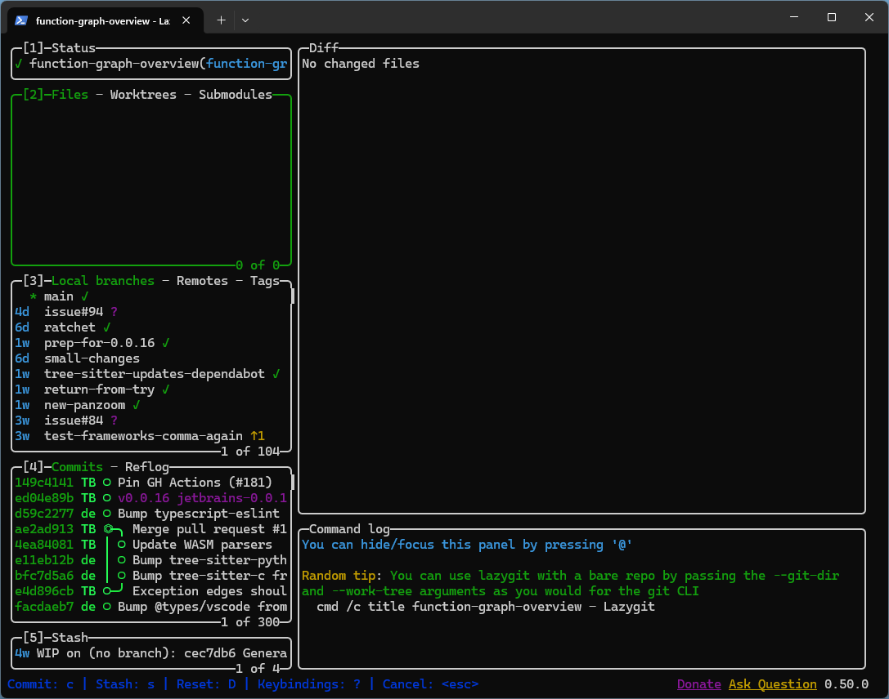
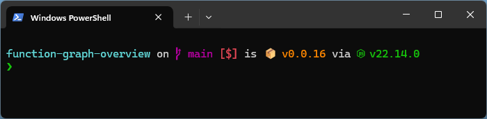
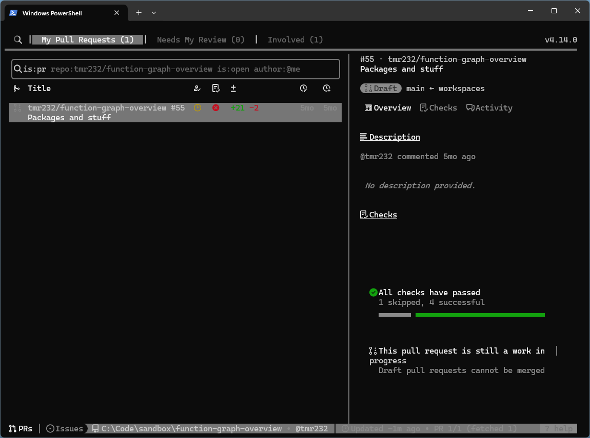

I recently started at a new job.
After 2 years of solo projects, I'm working with many developers on the same project.
And after years of local Windows dev, I'm suddenly doing remote dev on Linux.
Naturally, I needed some new tools for a decent expernience.

(tl;dr: [Lazygit], [Atuin], [Starship], [gh-dash])

## [Lazygit]

This is probably the tool I've been most excited about in a while.

Lazygit "a simple terminal UI for git commands", and it's phoenomenal.

When you open it (out of the box and without any configuration), you'll see several panels.
If you look at the "Branches" panel, you'll see your local branches _sorted by last update_,
and you can check them out by pressing `Space`.
This is almost enough for me to recommend the tool.
The "Files" panel shows you all the modified/staged files, and allows you to stage them,
stage parts of them (interactively, with easy undo!), or revert changes.
Everything is accessible via both keyboard and mouse, and works really fast.

In addition to all the obvious git operations (staging, committing, pushing, automatically
updating the default branch, and so on and so forth), it has some really advanced features.

If you go to the "Commits" panel, you can modify them.
You can re-order or drop commits entirely; reword a commit; or even undo a specific file-change in a specific commit.
And all if it through a super simple interface and without the need to ever write `git rebase` on your own.

It's a great tool, really easy to start using, yet absolutely full of advanced features.
I highly recommend it!

## [Atuin]

I use Atuin to manage my shell history across multiple remove machines, and it does a fantastic job.
It is easy to set up, easy to use, and avoids a whole mess of "what did Bash do with my history?" issues.

## [Starship]

Starship is a cross-shell prompt.
I use it with PowerShell on my Windows machine, and I could just take the same config and use it on
my Bash shell on Linux.

## [gh-dash]

If you're working a lot with GitHub you might be familiar with [gh] (the GitHub CLI).
And `gh` is great, but it isn't interactive.
You run a command to see all your open PRs, then a command to check their status, then a command to check them out...

Luckily, there are great tools wrapping it, and `gh-dash` is one of them.
It creates a fancy TUI for GitHub, allowing me to see my open PRs and the PRs waiting
for my review, and check them out with a single click (you might need to configure the location of your local repos),
making it a great time-saver for me.

[Lazygit]: https://github.com/jesseduffield/lazygit
[Atuin]: https://atuin.sh/
[Starship]: https://starship.rs/
[gh-dash]: https://github.com/dlvhdr/gh-dash
[gh]: https://cli.github.com/
