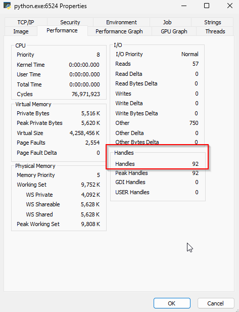

Once I define a model for thinking, I find that it is good to keep running it over in your mind, and see how it applies to different situations.
To see if it holds for all cases, or if there are edge-cases that make it fall apart; or to see if there are interesting things to learn when applying it to real-world scenarios.

So, having [talked about resources in my previous post][previous post], I spend some time thinking about interesting edge-cases with resource-management in GC languages.
After a while, I thought about mutexes and locks.
They are an interesting example as they are usually made up of 2 separate resources.

## Locks & Mutexes

When we think about locks, there is one obvious acquire-use-release cycle we think about.
We acquire the lock, use the resource it guards, then release the lock when we're done.

```python
with thing.lock:   # Acquire the lock
	thing.modify() # Use the guarded resource
# Release the lock as we exit the scope
```

But in most cases, we have another resource - the lock itself.
On Windows, for example, a mutex can be creates using the [CreateMutex](https://learn.microsoft.com/en-us/windows/win32/api/synchapi/nf-synchapi-createmutexa) function.
That, in turn, returns a handle to the OS-level mutex.
When we're done using it, we need to call [CloseHandle](https://learn.microsoft.com/en-us/windows/win32/api/handleapi/nf-handleapi-closehandle) to close the handle and have the OS release the mutex.
But... I never released a mutex in Python.
So what's going on?

### Python's `threading.Lock`

First, I wanted to make sure Python's [`threading.Lock`](https://docs.python.org/3/library/threading.html?highlight=threading%20lock#threading.Lock) is indeed backed by an OS-level mutex.
I could read the code, but there are simpler ways.

[Process Explorer](https://learn.microsoft.com/en-us/sysinternals/downloads/process-explorer) allows us to see the number of handles used by a process.
So if we create some locks, we should see the handle-count increasing.

```python
from threading import Lock

# Wait for input, so that we can open the process in ProcExp
input()
# Create 100 locks
locks = [Lock() for _ in range(100)]
# Wait for input, so that we can see the increase
input()
```

At first, we see that we have 92 handles:

Then we press `Enter`, and see the number increase to 192:


Which is what we expected.
This indicates that Python's `threading.Lock` is indeed backed by an OS mutex in Windows.
But... We never release those mutexes ourselves, so what is going on?

First, we need to make sure Python does not simply leak those resources.
By adding the following lines to our code:
```python
# Delete the locks, so that they can be released  
del locks  
input()
```
We can see that after `del locks`, the handle count drops back down to 92.
So how does this happen?

### Finalizers & The `__del__` Method

To handle such cases, Python uses **finalizers**, implemented using [the `__del__` method](https://docs.python.org/3/reference/datamodel.html?highlight=__del__#object.__del__).
The `__del__` method is called when an object is about to be destroyed.
As Python is a GC language, the language runtime owns the objects, and is responsible for destroying them _at its own time_.
This means that while it can be called immediately after we run `del locks`, it can also be called much later, or not at all.
Our only guarantee is that if and when the GC reclaims the memory of our object, it'll also call the `__del__` method to clean it up properly.

This is bad for unique-resources, and is why we use a context-manager to manage the lock itself.
But for counted-resources, like the OS handle representing the mutex itself - this is a good solution.
Even if the finalizer is not called before our process terminates, the OS itself will be sure to release those handles upon process termination.

## Lessons Learned

From this we learn a new lesson about Python, and our model.
For unique-resources, we want to use context-managers, to ensure release at the right time.
For counted-resources, we can use finalizers, and know that it's good enough.
In real code, we'll see that finalizers are usually used to wrap OS resources, and almost never user-defined-resources.

## Other Languages

Now that we know how Python handles counted-resources, we can have a look at some more languages.

### Java & C\#

In Java, things are roughly the same.
It's another object-oriented language, and it uses [finalizers](https://docs.oracle.com/javase/specs/jls/se20/html/jls-12.html#jls-12.6 "Java finalizers") for the same purposes.
[C# behaves similarly](https://learn.microsoft.com/en-us/dotnet/csharp/programming-guide/classes-and-structs/finalizers "C# finalizers"), being another object-oriented language.
I will venture a guess, and say that most GC object-oriented languages use finalizers.

But, not all GC languages are object-oriented.
Go, for example, is not.
As such, it is interesting to see how it tackles the same problem.

### Go

Looking at [A Tour of Go](https://go.dev/tour/concurrency/9), we see that mutexes are used as simple structs.
There's no `NewMutex()` function nor `CloseMutex()`.
This is odd, as Go does not have finalizers.
But, looking at the implementation of the [`sync.Mutex`](https://cs.opensource.google/go/go/+/refs/tags/go1.21.0:src/sync/mutex.go;l=34) struct things become clear:
```go
type Mutex struct {
	state int32
	sema  uint32
}
```
Go mutexes are not backed by OS mutexes. 
This is probably because Go uses goroutines instead of OS-level threads, and manages its own concurrency.
Nice going, Go!

But what of other OS-level objects?
Go can make its own mutexes, but sockets, for example, _must_ go through the OS.

#### Sockets

In Python, sockets are managed the same way mutexes are.
You can change the `threading.Lock` to `socket.socket` in the code we used above to see the effects.
In Go, however, they opted for a different solution.
Instead of having a "socket" object, [they have "connection" objects](https://pkg.go.dev/net#DialTCP "Go's connection objects").
Those connection objects are _obviously_ unique-resources, as one needs to close their connections (that's true in Python as well!).
So by modifying the API, they remain consistent and avoid leaks.


## Final Words

By taking our model and applying to it different situations, we managed to learn some new things and reach new insights.

We learned about finalizers, and how they are used to manage counted-resources in GC languages.
And we learned about Go's scheduling, with their own mutexes; and their clever choices in the socket API to handle the lack of finalizers.

As we keep pushing our understanding of programming languages, and trying to apply it to more situations, I'm sure we'll learn a lot more.

[previous post]: ../resource-management-01