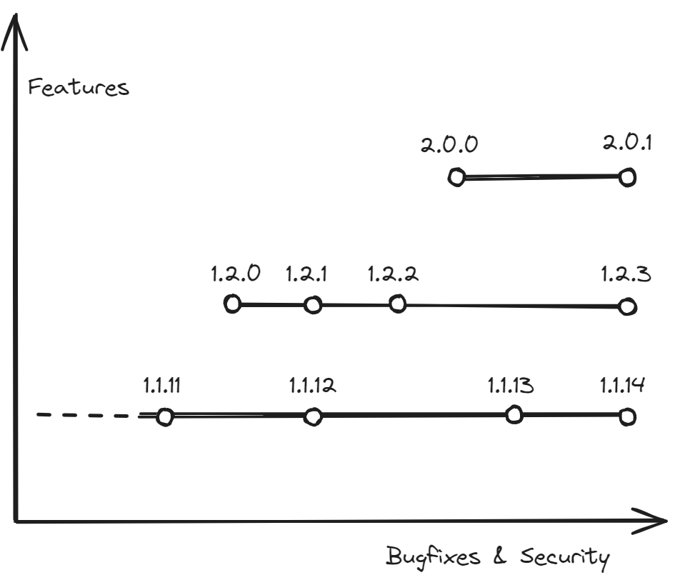

## Version Numbers

Current software versioning schemes conflate two different axes of progress - "features" and "bugfixes" - into a single "number".
This works well as long as only a single version is supported by the maintainers, but breaks apart when more than one version is supported.

As long as we have a single version, we can generally say "bigger is better".
The larger the version number, the better the software is.
More features, less bugs.
But as soon as we support more than one version, this logic breaks.
A bugfix version (`1.1.14`) will never be "bigger" than the next minor or major version (`1.2.0` or `2.0.0`), but it may include critical security fixes you need.

This means that instead of specifying `>=1.1.14` as the required version, users must specify something equivalent to `1.1.14 <= v < 1.2.0 || 1.2.3 <= v < 1.3.0 || 2.0.1 <= v < 2.1.0`, and add any new minor or major version they want to support as it comes out.
If a new critical bugfix is released, they need to update all the conditionals, hoping they don't get them wrong.

This is maintenance hell.
In addition to being error-prone, this fine-grained dependency specification increases the chances of conflicting dependencies; especially if one package updates a dependency to address a security issue, while another doesn't.
We need a better solution, one that properly addresses the different concerns of feature updates vs. bugfixes & security updates.
We need another axis in our versioning.

## Patch Levels

Security patch levels can provide this missing axis.
Just like two versions with the same major and minor versions are expected to have the same features, two versions with the same patch-level are expected to have the same critical bugfixes.

Now, we can change our dependency specification to `v >= 1.1.14 && patch >= PL3`.
This is shorter, simpler, and more flexible.
If `1.3` were to come out, we won't have to touch our dependency specification.

While these _can_ work with any type of patch, they require more work on the package-maintainer side, as they now need to specify them for all the released versions.
As such, it seems good practice to stick to critical bugfixes, or security bugfixes.

### In Practice

An example of a project using security patch levels is the Android operating system, using them in their [Android Security Bulletins](https://source.android.com/docs/security/bulletin/asb-overview), and use dates as security levels (instead of a running number).
Unfortunately, I am unaware of any package/dependency managers using a similar mechanism.
